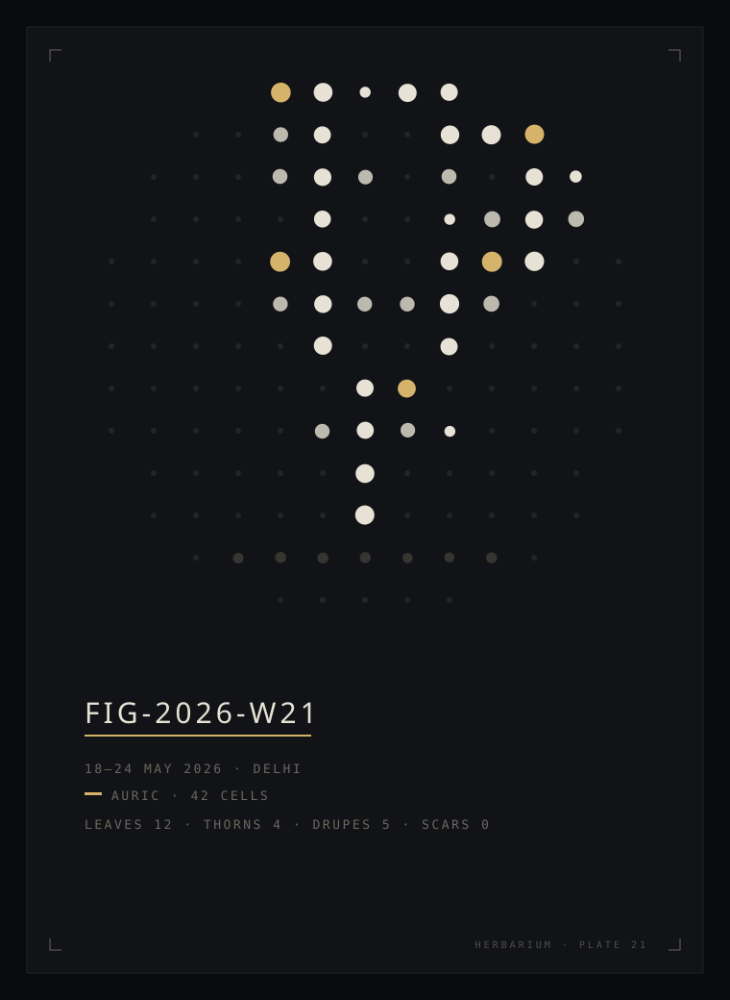
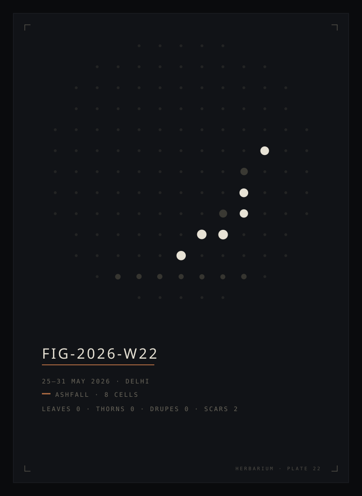
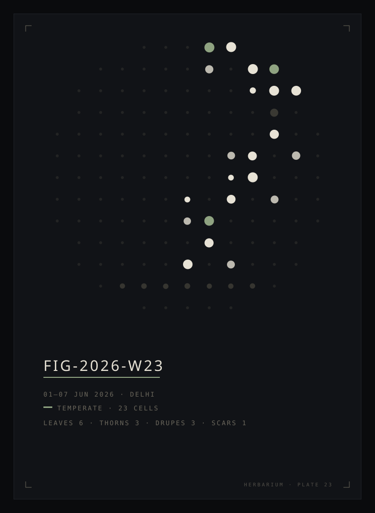
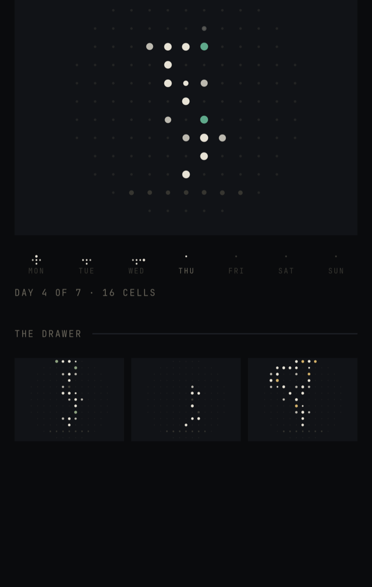
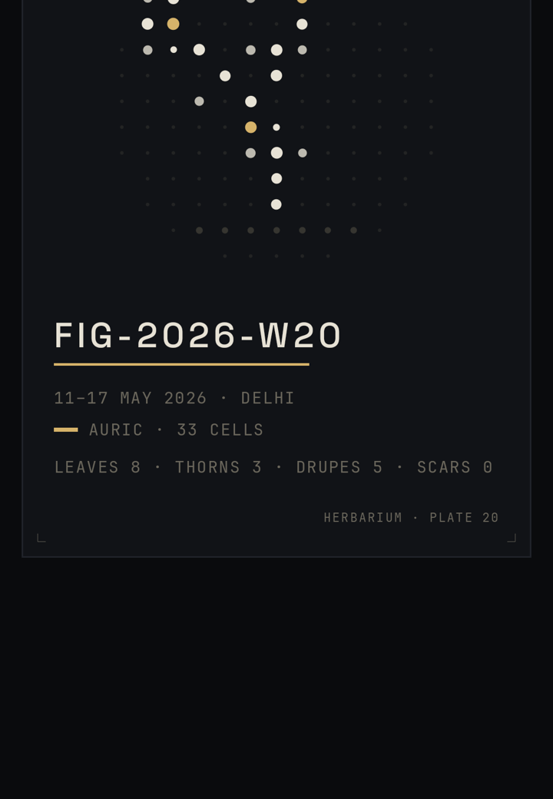
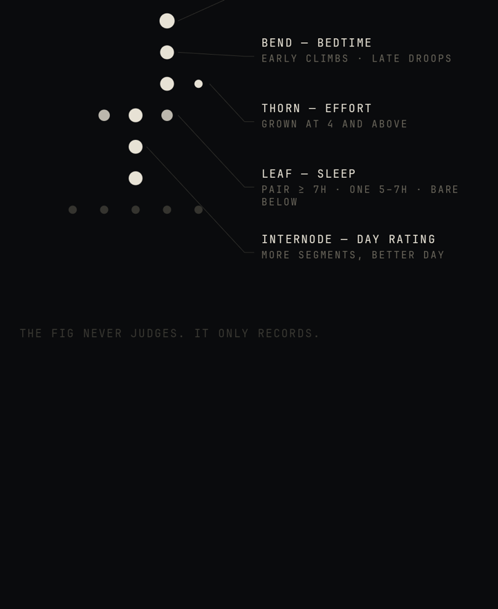
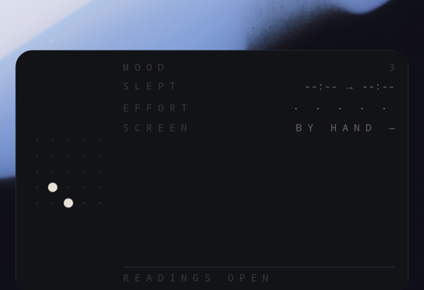

# figly

One fig per week — a small alien plant, rendered on the rear Glyph Matrix
of a Nothing Phone (4a) Pro, whose shape is a truthful record of how the
week was lived. Five readings a day are its only weather. At week's end
the fig is pressed into an archive, like a botanist pressing a specimen,
and a new seed is set.

The fig never judges; it only records.

<p align="center">
  
  
  
</p>
<p align="center"><sub>the three golden weeks — same organism, different lives.
a good week is not a high score; it is a taller plant.</sub></p>

## the triad

One APK, three surfaces, one organism:

| unit | surface | job | material |
|---|---|---|---|
| **LOOM** | Glyph Matrix (AOD toy) | *weaves* — grows the living fig | light |
| **PROBE** | home-screen widget | *asks* — takes the day's five readings | voice |
| **HERBARIUM** | the app | *keeps* — archives pressed figs | ink |

Loom glows, Probe asks, Herbarium presses. A pressed fig never glows; the
live fig never carries color. Flip the phone face down and the fig is
awake; growth blooms in cell by cell on the first flip after a day is
sealed — growth must be witnessed, never animated to an empty room. On
Sunday night the pressing ceremony plays: the week replayed fast, the
light drained into the soil, one ember in the dark, a new seed.

<p align="center">
  
  
  
</p>
<p align="center">
  
</p>
<p align="center"><sub>this week and the drawer · a pressed plate · the key · probe, mid-morning, two answers in</sub></p>

## the grammar

The fig is a pure deterministic function — `fig = grow(weekSeed, readings)`.
Same data, same fig, always. The seed contributes organic jitter only;
data dominates form. Each reading shapes exactly one channel, never
blended, all scales 1–5:

```
mood            → internode length   more segments, better day
sleep duration  → leaves             pair ≥ 7h · one 5–7h · bare below
bedtime         → tropism            early nights climb, late nights droop
physical effort → thorn              grown at 4 and above
screen budget   → drupe              under budget bears the only near-max light
a missed day    → scar               one dim cell, straight up. honest gaps.
```

Growth is append-only and lacy (a cell never accepts more than two
neighbors — cramped weeks make cramped figs), and a bud whose tip is
shaded relocates down the week's wood like an axillary shoot, so no lived
day is ever silently erased. A fully-missed week still presses: a
scar-column specimen, season BARREN, no tint. The archive is honest.

Three golden weeks are pinned as ASCII snapshots in `core-morphology` —
changing the grammar fails a test and is a product decision, not a
refactor:

```
        W W W W D                · · · · ·                  · · D W W
    · · · · l · W l D        · · · · · · · · ·          · · · · · · t D W
  · · · · · · · W · t W    · · · · · · · · · · ·      · · · · · · · · · W ·
  · · · · · · l · W W W    · · · · · · · · · · ·      · · · · · · · · x · ·
· · · · · · · · W D · l ·  · · · · · · · · · · · · ·  · · · · · · · · l W · · ·
· · · · · · · l W l l · ·  · · · · · · · · · · W · ·  · · · · · · · l t W · · ·
· · · · · · · · W · · W D  · · · · · · · · · x · · ·  · · · · · · · · W · · · ·
· · · · · · W D · · W · l  · · · · · · · · · W · · ·  · · · · · · · W · l · · ·
· · · · · l W l t W · · ·  · · · · · · · · x W · · ·  · · · · · · l D · · · · ·
  · · · · · W · l W · ·      · · · · · · W W · · ·      · · · · · · W · · · ·
  · · · · · W W W · · ·      · · · · · W · · · · ·      · · · · · W · l · · ·
    · ~ ~ ~ ~ ~ ~ ~ ·          · ~ ~ ~ ~ ~ ~ ~ ·          · ~ ~ ~ ~ ~ ~ ~ ·
        · · · · ·                  · · · · ·                  · · · · ·

        AURIC                      ASHFALL                     MIXED
```

`figly-reference-plate.svg` (repo root) is the original hand-authored
style bar — dot sizing, press jitter, label typography, tint dosage. Its
fig predates the 1–5 scales and was drawn freehand (its wood is not
step-connected), so morphological truth lives in the goldens; visual
truth lives in the reference plate. When in doubt, match the plate.

## color is rationed

Each pressed week takes one tint from its mean day-rating — a climate,
never a verdict: ASHFALL `#A3653F` · OVERCAST `#7C8B94` · TEMPERATE
`#8FA381` · VERDANT `#5FA98B` · AURIC `#D6B36A`. The tint appears in
exactly three places — drupe dots, the season tick, the specimen-ID
underline — and nowhere else. Bad weeks aren't red; ashfall is
rust-beautiful.

## privacy

The manifest never asks for `INTERNET`, and the network-flavored
permissions its libraries try to smuggle in are stripped. Verify:

```
aapt dump permissions app-release.apk
```

No analytics, no crash reporting, no network stack. Optional and opt-in:
usage access (screen budget + sleep suggestion — everything degrades
gracefully to manual without it), coarse location (the `COLLECTED` city
on plates), notifications (a silent 21:30 reminder, default off). Figs
may move house to a new phone via device transfer; they are excluded
from cloud backup.

## building

```
JAVA_HOME=<jdk17> ./gradlew :app:assembleRelease
./gradlew :core-morphology:test          # the grammar + golden weeks
./gradlew :core-morphology:renderGoldens # press the goldens to /tmp/figly-plates
```

Modules: `:core-morphology` (pure Kotlin, zero Android) · `:data` (Room,
the press lifecycle) · `:glyph` (Loom) · `:widget` (Probe, Glance) ·
`:app` (Herbarium — Compose foundation only, no Material, no ripples;
the press indication is a 5 % dim).

Debug builds carry demo flora for screenshots and development:

```
adb shell am start -n app.figly/.MainActivity --ez plant_demo true
```

Release builds carry a no-op twin. The release APK is debug-signed for
sideloading; this is a personal instrument, not a storefront.

## on device

1. `adb install -r app/build/outputs/apk/release/app-release.apk`
2. First launch shows The Key — how to read a fig — offers to place
   Probe, and deep-links the Glyph Toys manager.
3. Settings → Glyph Interface → Flip to Glyph → Always-on Glyph Toy →
   figly. Face down, the fig is awake.

## provenance

- Spec: [`FIGLY-SPEC.md`](FIGLY-SPEC.md) — the build bible this
  implementation answers to, including its Taste Law.
- Glyph Matrix SDK vendored in `libs/` from Nothing's
  [GlyphMatrix-Developer-Kit](https://github.com/Nothing-Developer-Programme/GlyphMatrix-Developer-Kit)
  (license alongside).
- Type: [Space Grotesk](https://github.com/floriankarsten/space-grotesk)
  and [JetBrains Mono](https://github.com/JetBrains/JetBrainsMono), both
  SIL OFL — texts in [`licenses/`](licenses/).
